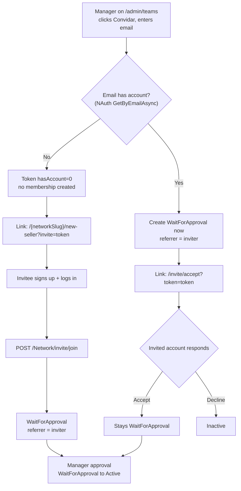

# Referrer Invite

> Manager-initiated network invites that record the inviter as the new member's referrer.

**Created:** 2026-07-03
**Last Updated:** 2026-08-03 (invite visibility on `/admin/teams`)

---

## Overview

Network managers invite people into a network from `/admin/teams`. When the
invitee joins, the inviting manager is recorded as the new member's **referrer**
via the existing `user_networks.referrer_id` column.

- Membership and referrer live in the existing `monexup_user_networks` table and
  its `referrer_id` column (nullable, no FK, holds a NAuth `UserId` by
  convention).
- Invites sent to e-mails **with no account yet** get their own row in
  `monexup_network_invites` — they cannot live in `monexup_user_networks`, whose
  PK requires a user id. See [Pending invites](#pending-invites-no-account).
- `monexup_user_networks.invited_at` marks memberships that came from an invite.
  `referrer_id` alone cannot: `RequestAccess` sets it too.
- Invited memberships still pass through the **existing manager approval** step
  (`WaitForApproval → Active`), which is unchanged.
- Self-service joins (no invite) keep an empty `referrer_id` and a null
  `invited_at` — no false attribution.

---

## Two Flows

Account existence for the entered email is detected **server-side** through NAuth
`IUserClient.GetByEmailAsync` (a not-found result means "no account").

### Flow A — No account (new person)

1. Manager enters an email that has no account. A **pending invite row** is
   created in `monexup_network_invites` (idempotent per `(network, email)`) and
   the backend builds a token with `hasAccount = 0`, `targetUserId = 0` and the
   new `inviteId` segment. **No membership row is created yet** — there is no
   user id to key it on.
2. The dialog produces the link `/{networkSlug}/new-seller?invite={token}`.
   The invite is immediately visible on `/admin/teams` as a pending row.
3. The invitee opens the link, signs up, and logs in. The `SellerAddPage` reads
   `?invite=` and calls `POST /Network/invite/join`, enrolling the caller into
   the network as `WaitForApproval` with `referrer = inviter` and
   `invited_at = now`. The invite row is marked `Accepted` (`consumed_at`,
   `consumed_user_id`) and disappears from the pending list.

### Flow B — Existing account (accept / decline)

1. Manager enters an email that already has an account. A `WaitForApproval`
   membership is created **immediately** (`referrer = inviter`), so the invitee
   shows in the team list before responding.
2. The dialog produces the link `/invite/accept?token={token}` (`hasAccount = 1`).
3. Only the **invited account** may respond on the accept/decline page:
   - **Accept** → confirms intent; the membership stays `WaitForApproval`
     (still needs manager approval). No status change.
   - **Decline** → the membership is set to `Inactive` (history preserved, no
     hard delete).

---

## Invite Link

The link is **HMAC-SHA256 signed**, has **no expiry**, and is **reusable**. The
token itself is never stored — it is deterministic, so "copy link again" from
`/admin/teams` just re-signs it.

- **Format:** `base64url(payload) + "." + base64url(HMAC-SHA256(secret, payload))`
- **Payload:** `networkId|inviterUserId|targetUserId|hasAccount`, plus an
  optional 5th `|inviteId` segment.
- The 5th segment is emitted **only when `inviteId > 0`** (no-account invites,
  which have a row in `monexup_network_invites`). Existing-account tokens keep
  signing the 4-segment payload, so they stay byte-identical to the pre-`inviteId`
  format.
- `TryVerify` accepts 4 or 5 segments; a 4-segment token yields `InviteId = 0`.
  **Every link already issued keeps verifying** — legacy no-account tokens simply
  have no invite row to reconcile, and `JoinFromInvite` skips that step.
- Signature verification uses a constant-time comparison
  (`CryptographicOperations.FixedTimeEquals`). Tampering with any segment —
  including the invite id — invalidates the token.

### Signing secret

The secret is read via `IConfiguration` under the key **`Invite:Secret`**
(no `Environment.GetEnvironmentVariable`). It is wired in:

| Location | Key |
|----------|-----|
| `appsettings.Development.json` | `Invite:Secret` |
| `appsettings.Docker.json` | `Invite:Secret` |
| `docker-compose.yml` | `Invite__Secret` |
| `.env.example` | `INVITE_SECRET` |

---

## Backend

- **`IInviteTokenSigner` / `InviteTokenSigner`** (`MonexUp.Domain`) — `Sign(...)`
  and `TryVerify(...)` for the token described above. Registered in
  `MonexUp.Application/Initializer.cs`.
- **`NetworkService`** methods:
  - `InviteByEmail` — resolves account existence, creates the immediate
    `WaitForApproval` membership for existing accounts (or a pending
    `monexup_network_invites` row for new ones), and returns the signed token +
    `networkSlug`.
  - `JoinFromInvite` — enrolls the caller (`hasAccount = 0` path) as
    `WaitForApproval` with `referrer = inviterUserId` and `invited_at = now`,
    then consumes the invite row when the token carries an `inviteId`; idempotent.
  - `ListPendingInvites` — manager-only listing of pending no-account invites,
    with the token re-signed per row and inviter names resolved through a cache
    (one NAuth call per distinct inviter).
  - `CancelInvite` — manager-only; sets a pending invite to `Cancelled`.
  - `GetInviteDetail` — verifies the token and returns network + inviter display
    info plus `isForCurrentUser`.
  - `AcceptInvite` — verifies token and ownership; ensures the pending
    membership exists (idempotent, no status change).
  - `DeclineInvite` — verifies token and ownership; sets the pending membership
    to `Inactive`.
- **Endpoints** on `NetworkController` (base `/Network`, `NAuth` scheme).
  Response DTOs follow the project convention with Portuguese status fields
  (`sucesso`, `mensagemErro`).

The manager approval flow (`WaitForApproval → Active`) reuses the existing
`ChangeStatus` logic and is unchanged. Referrer attribution is preserved across
all status changes.

### Endpoint reference

| Method | Path | Auth | Purpose |
|--------|------|------|---------|
| `POST` | `/Network/invite` | Network manager/administrator of `networkId` | Generate a signed invite link; creates the immediate pending membership for existing accounts. |
| `POST` | `/Network/invite/join` | Authenticated (newly created account) | New-account path: enroll caller as `WaitForApproval` with `referrer = inviter`. |
| `GET`  | `/Network/invite/detail?token={token}` | Any authenticated user | Return network + inviter info and `isForCurrentUser`. |
| `POST` | `/Network/invite/accept` | Authenticated; caller must equal `token.targetUserId` | Confirm intent; membership stays `WaitForApproval`. |
| `POST` | `/Network/invite/decline` | Authenticated; caller must equal `token.targetUserId` | Set the pending membership to `Inactive`. |
| `GET`  | `/Network/invite/list/{networkId}` | Network manager/administrator of `networkId` | List pending no-account invites (403 otherwise). |
| `POST` | `/Network/invite/cancel` | Network manager/administrator of the invite's network | Set a pending invite to `Cancelled` (403 otherwise). |

---

## Pending invites (no account)

`monexup_network_invites` exists because a no-account invite has no user id, and
`monexup_user_networks` has PK `(user_id, network_id)`. Without it the manager
loses every trace of an invite the moment the dialog closes.

| Column | Type | Notes |
|--------|------|-------|
| `invite_id` | `bigint` identity | PK. Also travels in the token's 5th segment. |
| `network_id` | `bigint` | FK → `monexup_networks`, `ON DELETE CASCADE`. |
| `email` | `varchar(180)` | Stored trimmed + lowercased. |
| `inviter_user_id` | `bigint` | No FK — users live in the NAuth schema. |
| `status` | `int` | `1 = Pending`, `2 = Accepted`, `3 = Cancelled`. |
| `created_at` | `timestamp` | Defaults to `now() at time zone 'utc'`. |
| `consumed_at` / `consumed_user_id` | nullable | Set when the invitee signs up and joins. |

Indexes: a **partial unique** index on `(network_id, email) WHERE status = 1`
(at most one pending invite per e-mail per network; consumed/cancelled rows are
kept as history), plus `(network_id, status)` for the listing.

### Visibility on `/admin/teams`

- Pending invites are served by the **separate, `[Authorize]`d**
  `GET /Network/invite/list/{networkId}`, gated by `ValidateManager`. They are
  deliberately **not** merged into `GET /Network/listByNetwork/{slug}`, which
  also feeds the public storefront — invitee e-mails must never reach an
  anonymous or non-manager caller.
- The page merges the two lists client-side, rendering invites first as
  `InviteSearchRow` (e-mail as the primary line, no profile/role chip, actions:
  copy link + cancel).
- Members that came from an invite show a **"Convidado"** badge while they are
  still `WaitForApproval`; once approved the badge is dropped — it is a pending
  qualifier, not permanent provenance.
- Stale invites are **not** auto-reconciled: if the invitee ignores the link and
  requests access on their own, the pending row lingers until a manager cancels
  it. Auto-consuming it would need an NAuth e-mail lookup per invite on every
  list call.

> `invited_at` is copied by `UserNetworkRepository.ModelToDb`, which does a
> full-row copy on every `Update`. Dropping it there would silently wipe the
> column on every `changeStatus`/approve — guarded by
> `UserNetworkRepositoryTests.Update_ShouldPreserveInvitedAt`.

---

## Frontend

New **Invite** module in `monexup-app` following the Service → Business → Provider
layering:

- `Services/Impl/InviteService` — HTTP client for the seven endpoints.
- `Business/Impl/InviteBusiness` (+ `Business/Factory/InviteFactory`).
- `Contexts/Invite/InviteProvider` (+ `InviteContext`) — also holds the
  `invites` list state consumed by `/admin/teams`.
- **`InviteModal`** (`Pages/Admin/InviteModal`) — the "Convidar" dialog on
  `/admin/teams`: email input, generate link, copy affordance. Closing it
  refreshes the list so a new invite appears immediately.
- **`InviteSearchRow`** (`Pages/UserSearchPage`) — pending-invite row on
  `/admin/teams`.
- **`AcceptInvitePage`** (`Pages/AcceptInvitePage`, route `/invite/accept`) —
  accept/decline for the invited account only.
- **`SellerAddPage`** (`Pages/SellerAddPage`) — reads `?invite=` and calls
  `invite/join` after sign-up + login.

Invite delivery is a **copyable link only** (no email in v1). i18n keys were
added for `pt`, `en`, `es`, and `fr`.

---

## Rules & Guarantees

- **Only the invited account** (`session.UserId == token.targetUserId`) may
  accept or decline; another logged-in account is prompted to sign in as the
  invited account (`isForCurrentUser = false` → 403 on accept/decline).
- **No duplicates.** An invite that resolves to a user who already has an
  `Active`/`WaitForApproval` membership does not create a second row; the
  existing state is surfaced (`alreadyMember` / `alreadyActiveMember`).
  `JoinFromInvite` and `AcceptInvite` are idempotent.
- A declined (`Inactive`) member may be reactivated to `WaitForApproval` by a
  re-invite.
- **Invitee e-mails are manager-only.** They are exposed exclusively by
  `GET /Network/invite/list/{networkId}`; `UserNetworkInfo` carries only a
  boolean `invited` flag, never the timestamp or an address.
- Re-inviting the same e-mail reuses the existing pending invite row (same
  `inviteId`, therefore the same link) instead of creating a duplicate.
